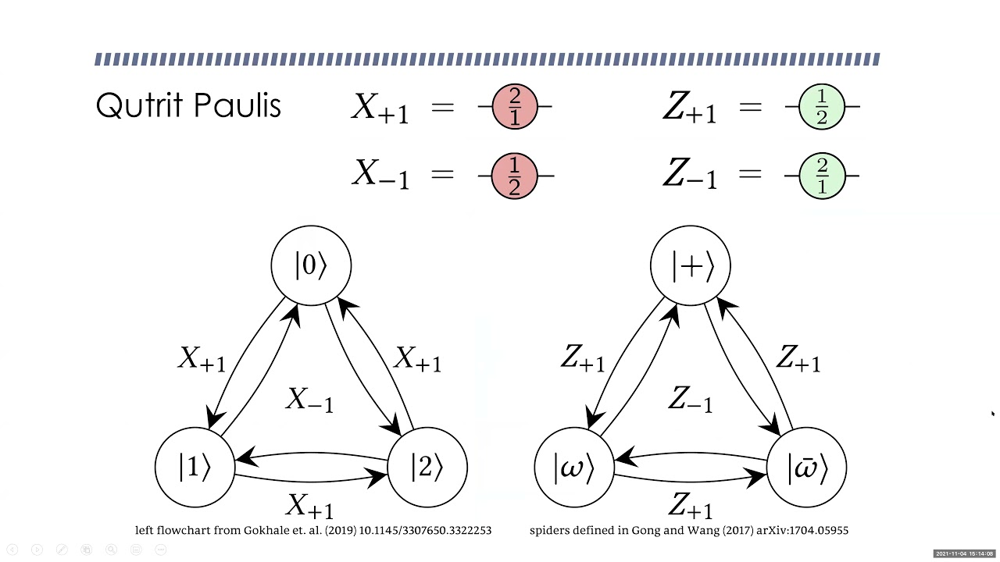

[](https://unitary.fund)

*[Image Reference](https://www.google.com/url?sa=i&url=https%3A%2F%2Fwww.youtube.com%2Fwatch%3Fv%3DVbiKCqy_mmg&psig=AOvVaw1S_GSos-28aYQVnZkevZp8&ust=1677162127754000&source=images&cd=vfe&ved=0CBEQjhxqFwoTCMinoPipqf0CFQAAAAAdAAAAABAE)* 
# Qutritium


## Installation

**Qutritium** runs in python environment. User can download newest python released **[here](https://www.python.org/downloads/)**.\
Recommendation: **[Anaconda](https://www.anaconda.com/products/distribution)** for environment separation

```bash
  pip install qutritium
```

## Package Standard Protocol

| Protocol        | Purpose and functionalities |
|-----------------|-----------------------------|
| Calibration     | ...                         |
| Virtual Machine | ...                         |

## Usage/Examples

```python
from qutritium.calibration import TR01

```

## Authors

- **[Son Pham](https://github.com/spham1611)**
- **[Tien Nguyen](https://github.com/ngdnhtien)**
- **[Bao Bach](https://github.com/bachbao)**

## License

[MIT License](LICENSE.txt)


## Documentation

[Documentation](https://linktodocumentation)


## References
<details open>
    <summary>Research Papers</summary>
    <ul>
        <li>M. Kononenko, M. A. Yurtalan, S. Ren, J. Shi, S. Ashhab, and A. Lupascu, “Characterization of control in a superconducting qutrit using randomized benchmarking,” Physical Review Research, vol. 3, no. 4, 2021. </li>
        <li>Kurter, C. Murray, R. Gordon, B. Wymore, M. Sandberg, R. Shelby, A. Eddins, V. Adiga, A. Finck, E. Rivera, A. Stabile, B. Trimm, B. Wacaser, K. Balakrishnan, A. Pyzyna, J. Sleight, M. Steffen, and K. Rodbell, “Quasiparticle tunneling as a probe of Josephson junction quality and capacitormaterial in superconducting qubits,” 2021. </li>
        <li>A. Morvan, V. V. Ramasesh, M. S. Blok, J. M. Kreikebaum, K. O’Brien, L. Chen, B. K. Mitchell, R. K. Naik, D. I. Santiago, and I. Siddiqi, “Qutrit randomized benchmarking,” Physical Review Letters, vol. 126, no. 21, 2021. </li>
        <li>M. Neeley, M. Ansmann, R. C. Bialczak, M. Hofheinz, E. Lucero, A. D. O'Connell, D. Sank, H. Wang, J. Wenner, A. N. Cleland, M. R. Geller, and J. M. Martinis, “Emulation of a quantum spin with a superconducting phase Qudit,” Science, vol. 325, no. 5941, pp. 722–725, 2009. </li>
        <li>M. J. Peterer, S. J. Bader, X. Jin, F. Yan, A. Kamal, T. J. Gudmundsen, P. J. Leek, T. P. Orlando, W. D. Oliver, and S. Gustavsson, “Coherence and decay of higher energy levels of a superconducting transmon qubit,” Physical Review Letters, vol. 114, no. 1, 2015. </li>
        <li>D. Ristè, C. C. Bultink, M. J. Tiggelman, R. N. Schouten, K. W. Lehnert, and L. DiCarlo, “Millisecond charge-parity fluctuations and induced decoherence in a superconducting transmon qubit,” Nature Communications, vol. 4, no. 1, 2013. </li>
        <li>K. Serniak, S. Diamond, M. Hays, V. Fatemi, S. Shankar, L. Frunzio, R. J. Schoelkopf, and M. H. Devoret, “Direct dispersive monitoring of charge parity in offset-charge-sensitive transmons,” Physical Review Applied, vol. 12, no. 1, 2019. </li>
        <li>S. Sheldon, L. S. Bishop, E. Magesan, S. Filipp, J. M. Chow, and J. M. Gambetta, “Characterizing errors on qubit operations via iterative randomized benchmarking,” Physical Review A, vol. 93, no. 1, 2016. 
    </ul>
</details>

